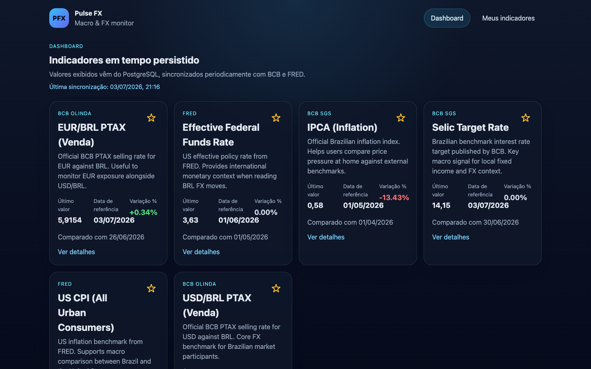
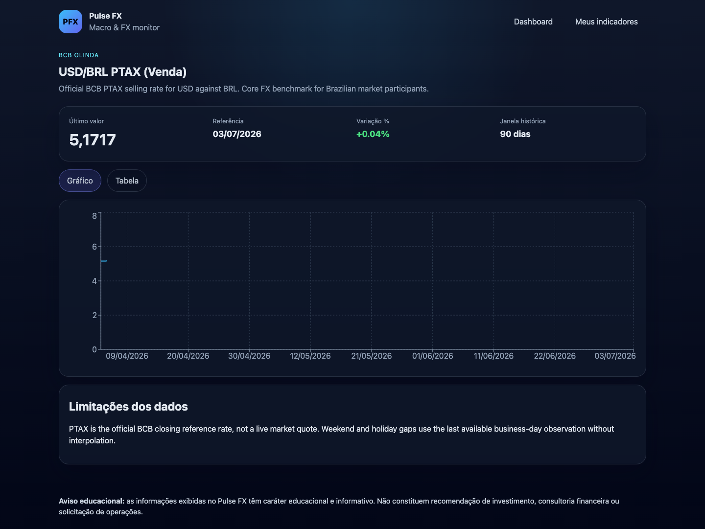

# Pulse FX

Pulse FX is an MVP for tracking **BRL exchange rates** and **macroeconomic indicators** from public sources (BCB and FRED), with persisted data, a dedicated API, and a production-oriented web client.

> **Disclaimer:** the information shown in Pulse FX is **educational** and **does not constitute investment advice**.

## Quick start (Docker)

Requirements: Docker and Docker Compose.

```bash
cp .env.example .env
# Edit .env and set FRED_API_KEY + ADMIN_TOKEN
docker compose up --build
```

Services:

| Service | URL |
|---------|-----|
| Web | http://localhost:5173 |
| API | http://localhost:3001 |
| Health | http://localhost:3001/health |

On first startup, the API runs an **automatic initial sync** (`RUN_INITIAL_SYNC=true` in Docker) before accepting traffic, so the dashboard is populated without manual steps.

Optional manual sync (protected):

```bash
curl -X POST http://localhost:3001/admin/sync \
  -H "Authorization: Bearer ${ADMIN_TOKEN}"
```

Expected startup time on a typical machine with Docker: **under 15 minutes** including image build, migrations, seed, and initial sync.

## Screenshots

| Dashboard | Detail (USD/BRL PTAX) |
|-----------|------------------------|
|  |  |

Captured from the local stack after seed + sync (`docker compose up --build` or `pnpm dev:api` + `pnpm dev:web`).

## Environment variables

| Variable | Description |
|----------|-------------|
| `DATABASE_URL` | PostgreSQL connection string |
| `FRED_API_KEY` | API key from [FRED](https://fredaccount.stlouisfed.org/apikeys) |
| `ADMIN_TOKEN` | Bearer token for `POST /admin/sync` |
| `PORT` | API port (default `3001`) |
| `CORS_ORIGIN` | Allowed frontend origin |
| `SYNC_TTL_DAILY_HOURS` | TTL for daily indicators before re-sync (default `6`) |
| `SYNC_TTL_MONTHLY_HOURS` | TTL for monthly indicators before re-sync (default `24`) |
| `RUN_INITIAL_SYNC` | Run a full sync on API startup (default `false` locally; `true` in Docker) |
| `VITE_API_URL` | Frontend API base URL |

## Architecture

```text
apps/web (React)
    ↓ HTTP
apps/api
  ├── domain/              pure business rules (variation %)
  ├── application/         use cases + ports
  └── infrastructure/
        ├── http/          Fastify routes
        ├── persistence/   Drizzle + PostgreSQL
        ├── external/      BCB Olinda, BCB SGS, FRED clients
        └── scheduler/     node-cron sync job
packages/shared            shared DTO types
```

Design principles:

- **Modular monolith** with explicit layer boundaries
- **Domain independence** (no Fastify/Drizzle/fetch in domain code)
- **Sync-first data flow**: dashboard reads **only PostgreSQL**, never external APIs directly
- **Idempotent upsert** on `(indicator_id, reference_date)`

## Technical decisions & trade-offs

| Decision | Choice | Trade-off |
|----------|--------|-----------|
| Backend framework | Fastify + manual layering | More boilerplate than Nest, but clearer authorship and boundaries |
| ORM / migrations | Drizzle + SQL migrations | Explicit SQL auditability vs Prisma abstraction |
| Favorites identity | Anonymous `client_id` cookie/header | Simple MVP persistence without full auth (explicitly out of scope) |
| Cache | PostgreSQL as source of truth | No Redis dependency; TTL gate avoids redundant external calls |
| Scheduler | In-process `node-cron` | Good for MVP; horizontal scaling would externalize jobs later |

## Selected indicators

### USD/BRL PTAX (Venda) — BCB Olinda (daily)

Official BCB closing reference for USD against BRL. It is the core FX benchmark for Brazilian market participants and the main pulse of BRL liquidity.

Docs: https://olinda.bcb.gov.br/olinda/servico/PTAX/versao/v1/swagger-ui3/

### EUR/BRL PTAX (Venda) — BCB Olinda (daily)

Second most relevant FX pair for users monitoring EUR exposure alongside USD/BRL in a single dashboard.

Docs: https://olinda.bcb.gov.br/olinda/servico/PTAX/versao/v1/swagger-ui3/

### Selic Target — BCB SGS (monthly)

Brazilian benchmark interest rate target. Useful macro context when interpreting FX and local fixed-income dynamics.

Docs: https://www3.bcb.gov.br/sgspub/

### IPCA — BCB SGS (monthly)

Official Brazilian inflation index. Helps compare domestic price pressure against external benchmarks such as US CPI.

Docs: https://www3.bcb.gov.br/sgspub/

### Effective Federal Funds Rate — FRED (monthly)

US effective policy rate from FRED. Provides international monetary context when reading BRL FX moves.

Docs: https://fred.stlouisfed.org/docs/api/fred/

### US CPI (CPIAUCSL) — FRED (monthly)

US inflation benchmark from FRED. Supports macro comparison between Brazil and the United States.

Docs: https://fred.stlouisfed.org/docs/api/fred/

## Variation rules

Same rule in **dashboard** and **detail**, implemented in `calculateVariation()`:

| Series type | Rule | Justification |
|-------------|------|---------------|
| Daily FX | Compare latest valid observation vs **5 business days** earlier (last available observation on/before target date) | Short enough to reflect recent FX movement, long enough to avoid single-day noise |
| Monthly macro | Compare latest valid observation vs **previous calendar month** observation | Monthly indicators must not use daily windows |

Additional calendar policy:

- Weekends and holidays: use the **last available observation**, never interpolation
- Missing history: variation returns `null` and UI shows `N/A`

## History windows

| Indicator type | Window |
|----------------|--------|
| Daily FX | 90 days |
| Monthly macro | 730 days |

## Sync policy

1. **Initial sync on startup** when `RUN_INITIAL_SYNC=true` (enabled in Docker Compose)
2. Scheduled job every **6 hours** (`node-cron`)
3. Per-indicator TTL gate before external calls:
   - Daily: `SYNC_TTL_DAILY_HOURS` (default 6h)
   - Monthly: `SYNC_TTL_MONTHLY_HOURS` (default 24h)
4. Normalized observations upserted with `ON CONFLICT DO UPDATE`
5. Manual trigger: `POST /admin/sync` with `Authorization: Bearer ${ADMIN_TOKEN}`

## Local development (without Docker for app code)

```bash
pnpm install
cp .env.example .env

# Start PostgreSQL (Docker)
docker compose up postgres -d

# API
pnpm --filter @pulse-fx/api db:migrate
pnpm --filter @pulse-fx/api db:seed
pnpm dev:api

# Web (separate terminal)
pnpm dev:web
```

## Tests & lint

```bash
pnpm lint
pnpm typecheck
pnpm test
pnpm build
```

Test files (minimum required by the challenge):

1. `apps/api/src/domain/calculate-variation.test.ts`
2. `apps/api/src/infrastructure/persistence/observation.repository.test.ts`
3. `apps/api/src/infrastructure/http/indicators.routes.test.ts`
4. `apps/api/src/application/use-cases/sync-indicators.integration.test.ts`
5. `apps/web/src/features/dashboard/IndicatorCard.test.tsx`

Integration tests use PostgreSQL (`pulsefx_test` by default via `TEST_DATABASE_URL`).

## API overview

| Method | Path | Description |
|--------|------|-------------|
| GET | `/health` | Health + DB connectivity |
| GET | `/indicators` | Dashboard list |
| GET | `/indicators/:code` | Detail + history |
| GET | `/favorites` | Favorites for `X-Client-Id` |
| POST | `/favorites` | Add favorite |
| DELETE | `/favorites/:indicatorId` | Remove favorite |
| POST | `/admin/sync` | Protected sync trigger |

## Repository layout

```text
pulse-fx/
├── apps/
│   ├── api/
│   └── web/
├── packages/
│   └── shared/
├── docker-compose.yml
├── .env.example
└── README.md
```

## Future improvements

- Externalized job runner for multi-instance sync coordination
- Observability stack (metrics/tracing)
- Optional authenticated user accounts for favorites portability
